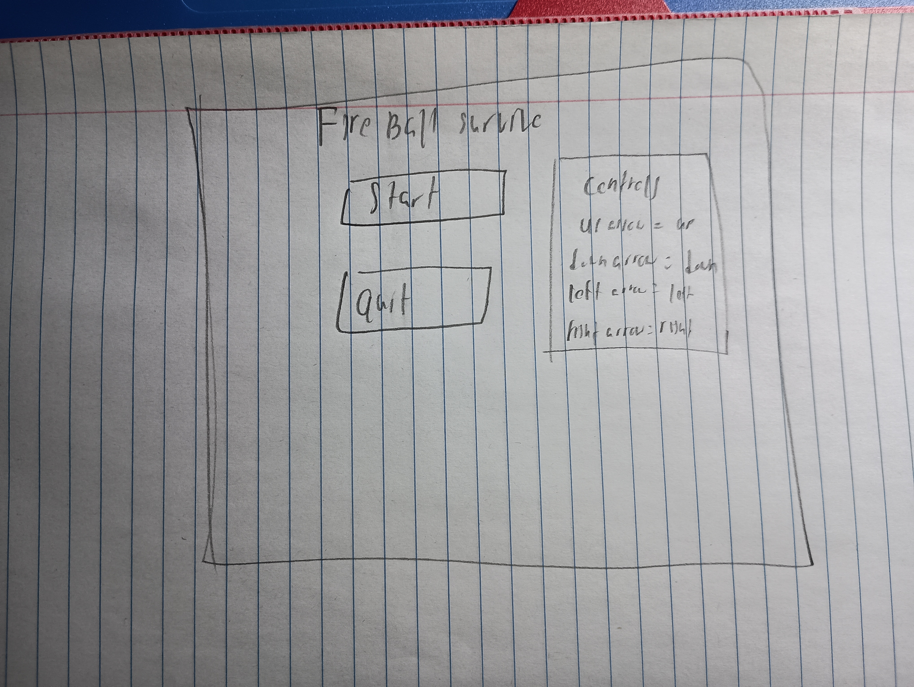
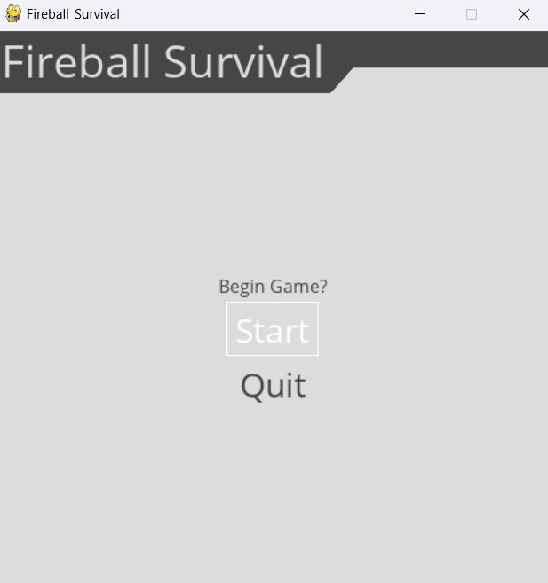

:warning: Everything between << >> needs to be replaced (remove << >> after replacing)

# FireBall Survival
## CS110 B1 Final Project  Fall Semester 2024

## Team Members

Matthew Ko

***

## Project Description

This project will be a two player game where one of the players control a simple blue character where they try to avoid the other red player
The blue character is faster and smaller, while the red character is slower but bigger

***    

## GUI Design

### Initial Design

### Final Design

## Program Design

### Features

1. Retry button 
2. Reset key for quick restarts
3. Two different characters
4. Main menu and gameover screens
5. Two player multiplayer 

### Classes

player
Rectangle that is controlled by first player
fire
Fireball rectangle that causes a gameover when the char touches it and is controled by second player
Up
moves char up
Down
moves char down
Left
moves char left
Right
moves char right
## ATP

| Step                 |Procedure             |Expected Results                   |
|----------------------|:--------------------:|----------------------------------:|
|  1 test Movement | Press Up/down/left/right or W/S/A/D|character will move up/down/left/right  |
|  2 Test menus    |Click the start button to see if it starts game, click Quit button to test if it ends the game, and back to menu button sends you back to start|Start button starts the gane, and quit button exits the game and back to menu button sends you back      |
   3 Test game over screen|Test if game over screen shows up if I force a game over by making a game over button or losing|Game over screen appears when i click escape key and if blue player touches red player 
   4 Test collision|Test if touching the fire rectangle can interact with character or if character can go out of bounds|Character can't go out of bounds and collides with fire 
   5 Test errors|Test any keys that might cause an error|No errors caused by any invalid inputs